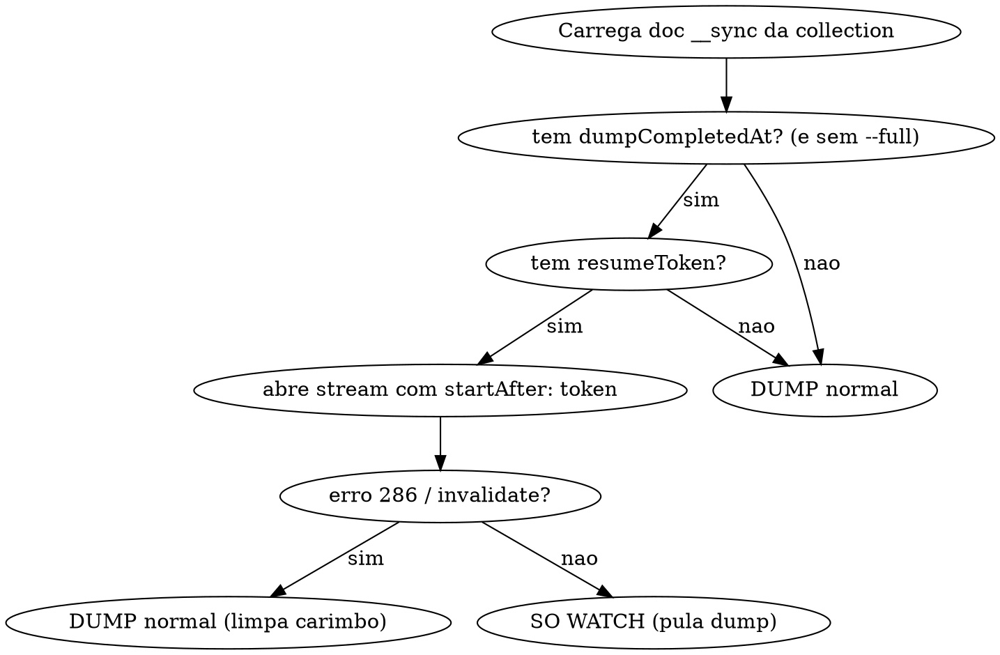

# Spec — Restart incremental do `sync` (resume token + carimbo de dump)

**Data:** 2026-06-18
**Status:** Implementado e testado (suíte `test/`, 24 testes verde + smoke E2E via CLI)
**Componente:** `src/core/sync/`, `src/commands/sync.ts`, `src/functions/freeze.ts`, `src/db/conn.ts` (leitura), `__sync` no destino

---

## Problema

Toda vez que o `sync` reinicia, ele refaz o **dump inicial de TODAS as collections** — re-lê
cada documento da origem pelo Atlas e compara hash, mesmo nas collections que já estavam 100%
sincronizadas. Num backfill real (~55 collections, várias com centenas de milhares / milhões de
docs), isso custa horas e re-paga o preço inteiro a cada restart.

O gatilho concreto: foi preciso **parar o pulsar** pra liberar conexões do Atlas pra um app de
outro dev. Parar hoje significa, ao religar, re-escanear tudo do zero.

### A pergunta que define o design

"Se eu pular a collection que já terminou, como é que um registro **atualizado na origem
enquanto o pulsar estava desligado** chega no destino?"

Pular o dump **sozinho** não resolve — perde as mudanças offline. A resposta é o **resume
token**: retomar o change stream exatamente de onde parou faz o MongoDB **repassar pelo oplog**
todas as operações (insert/update/delete) que ocorreram durante o downtime, sem re-escanear a
collection.

---

## Objetivo

No restart, para cada collection:

1. **Já terminou o dump + token ainda válido** → retoma o change stream pelo token (pega as
   mudanças offline via oplog) e **pula o dump**. Volta em segundos.
2. **Token velho demais** (downtime > janela do oplog → erro `ChangeStreamHistoryLost`/286) →
   cai no **dump completo** daquela collection.
3. **Dump nunca terminou** (interrompido no meio, ex. 28%) ou **primeira sync** → **dump
   normal**, como hoje.

Mais uma flag `--full` (CLI) pra **forçar dump completo de todas**, ignorando carimbos — usada
quando se quer reconciliação total de propósito.

## Não-objetivos (follow-ups separados)

- **`dados` (218M docs):** inviável pelo cursor doc-a-doc; precisa de estratégia própria
  (mongodump/restore). Tratado fora deste spec.
- **Bug `planoMidia`:** change stream em loop de erro (`Executor error ... Serializing
  Document`, provável doc > 16MB no `updateLookup`). Tratado fora deste spec.
- **Dead-letter de eventos engolidos:** não entra na v1 (ver "Limitações conhecidas").
- **Legibilidade dos logs:** melhoria separada.

---

## Estado de controle no destino (`__sync`)

A collection `__sync` já existe no destino (criada pelo `initSync` do `migrate`). O `sync` passa
a manter, **1 doc por collection**:

```jsonc
{
  "id": "<collectionName>",        // chave (já usada hoje)
  "dumpCompletedAt": 1718740000000, // epoch ms; setado quando o dump termina. Ausente = nunca terminou
  "resumeToken": { "_data": "82..." }, // último token aplicado pelo change stream; ausente = sem marcador
  "tokenUpdatedAt": 1718740005000   // epoch ms do último checkpoint de token (observabilidade)
}
```

- `dumpCompletedAt` é setado **uma vez**, quando o dump da collection conclui com sucesso
  (`finishDump`).
- `resumeToken` é atualizado **periodicamente** pelo change stream (ver cadência).
- `--full` limpa/ignora `dumpCompletedAt` no início, forçando o dump.

---

## Fluxo no startup (por collection, sem barreira global — igual hoje)



Pontos:

- **Caminho "só watch"** (terminou + token válido): NÃO faz `freezeCollection` e NÃO faz dump.
  O `freeze` só existe pra proteger o dump; sem dump, é irrelevante. O stream ao vivo re-marca
  `__sync.hot` normalmente.
- **Caminho "dump"** (qualquer um dos casos de dump): comportamento atual preservado —
  `freezeCollection` → abre stream → dump em batch. Ao abrir o stream nesse caminho, começamos
  **sem** `startAfter` (fresh), pois o dump é quem garante a base.
- O `startAfter: token` é o mesmo mecanismo que o `openChangeStream` já usa hoje na reabertura
  automática (`src/core/sync/index.ts`).

### Detecção do 286 / invalidate

Hoje o `openChangeStream` trata **qualquer** erro reabrindo em 5s com o último token. Precisamos
distinguir, **no caminho de resume do startup**:

- `ChangeStreamHistoryLost` (code 286) ou evento `invalidate` → o token é inútil → **fallback
  pro dump completo** dessa collection (limpa `dumpCompletedAt`, segue o caminho de dump).
- Outros erros transitórios → mantêm o comportamento atual (reabre em 5s com o token).

> A reabertura automática em runtime (depois que tudo já está rodando) também deve tratar 286:
> se o token expirar em pleno watch, a collection precisa de um novo dump. Caso raro, mas
> previsto.

---

## Checkpoint do resume token

- **Cadência:** a cada **~5s**, por collection ativa, persiste o **último token visto** pelo
  change stream (`change._id`) no doc `__sync` daquela collection. Só escreve se houve evento
  novo desde o último checkpoint (collection parada não gera write).
- **Implementação:** o `openChangeStream` já mantém `lastToken` em memória. Um timer (ou
  contador por tempo) faz o `updateOne` no `__sync` com esse valor.
- **Ordem de segurança (at-least-once):** persistimos o token do último evento **entregue** pelo
  stream. No restart, no pior caso reprocessamos alguns eventos já aplicados — inofensivo, pois
  toda escrita é idempotente (chaveada por `_id`, guardada por hash/`__sync.hot`).

---

## Flag `--full`

- CLI: `--full` (sem valor). Quando presente, no início do `sync` **ignora os carimbos**:
  toda collection segue o caminho de dump, como o comportamento de hoje.
- Precedência: é um override explícito do operador; não tem equivalente no yml (decisão
  pontual, não configuração permanente).

---

## Limitações conhecidas (v1)

1. **Evento ao vivo engolido por erro de handler.** Os handlers não dão throw (resiliência). Se
   um evento falhar silenciosamente, o checkpoint pode avançar além dele → esse doc fica
   desatualizado até o próximo `--full`. **Não é regressão:** hoje os handlers já engolem erros;
   a diferença é que o re-dump de hoje cura por acaso. Mitigação disponível: `--full`. Dead-
   letter cirúrgico fica como evolução futura.
2. **Downtime > janela do oplog.** Cai no dump completo (286). Esperado e seguro.
3. **Origem é sempre a fonte da verdade** — nenhum caminho sobrescreve a versão ao vivo
   (`__sync.hot`), então nenhum dos casos acima corrompe dado; o pior caso é atraso até a
   próxima reconciliação.

---

## Critérios de aceite

- [ ] Restart de uma collection já 100% **não re-escaneia** a origem (0 leituras de doc no
      caminho do cursor) e abre o watch com `startAfter`.
- [ ] Um update feito na origem **com o pulsar desligado** aparece no destino após o restart
      (via oplog), sem dump.
- [ ] Token expirado (286) numa collection terminada → essa collection **re-dumpa** sozinha; as
      demais seguem o caminho rápido.
- [ ] Collection com dump interrompido (sem `dumpCompletedAt`) **re-dumpa** no restart.
- [ ] `--full` força dump completo em todas, ignorando carimbos.
- [ ] `dumpCompletedAt` só é gravado quando o dump conclui de fato (`finishDump`).
